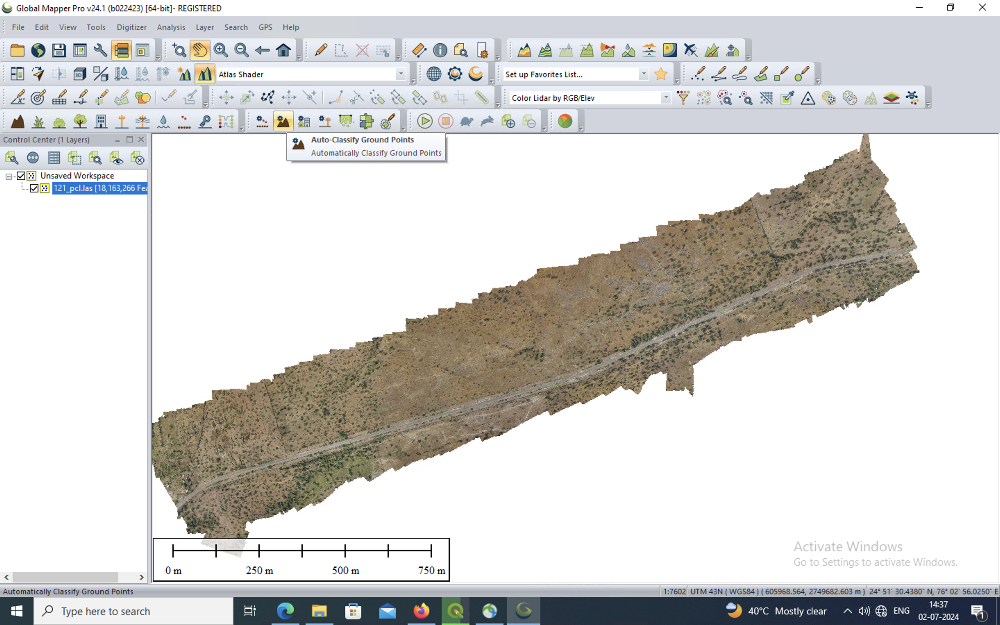
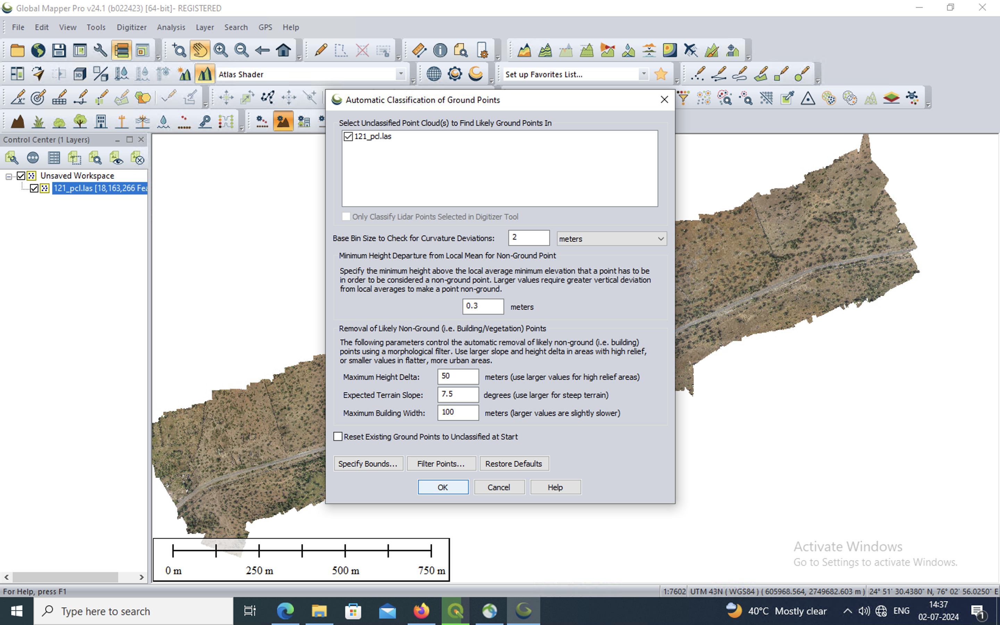
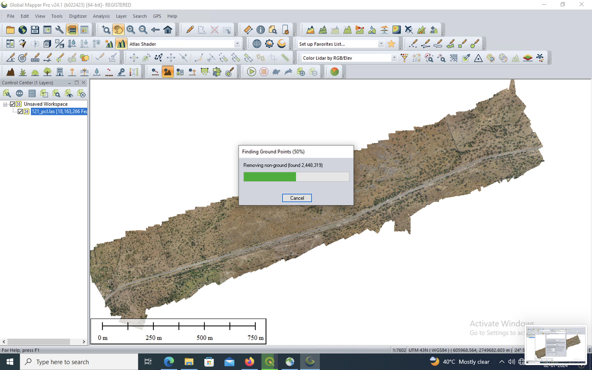
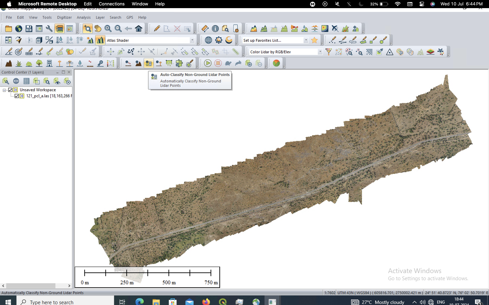
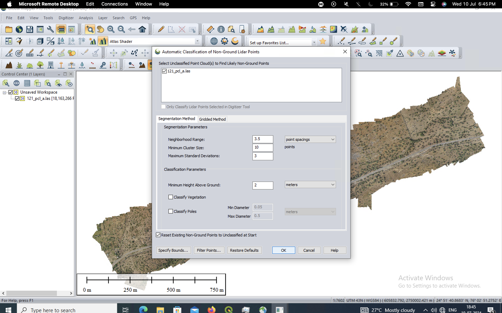
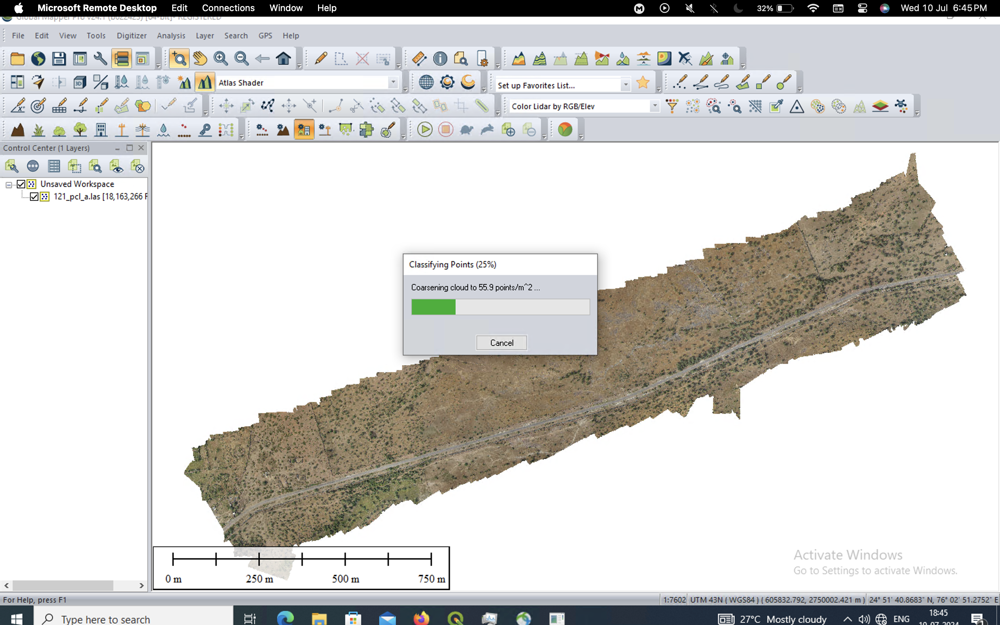
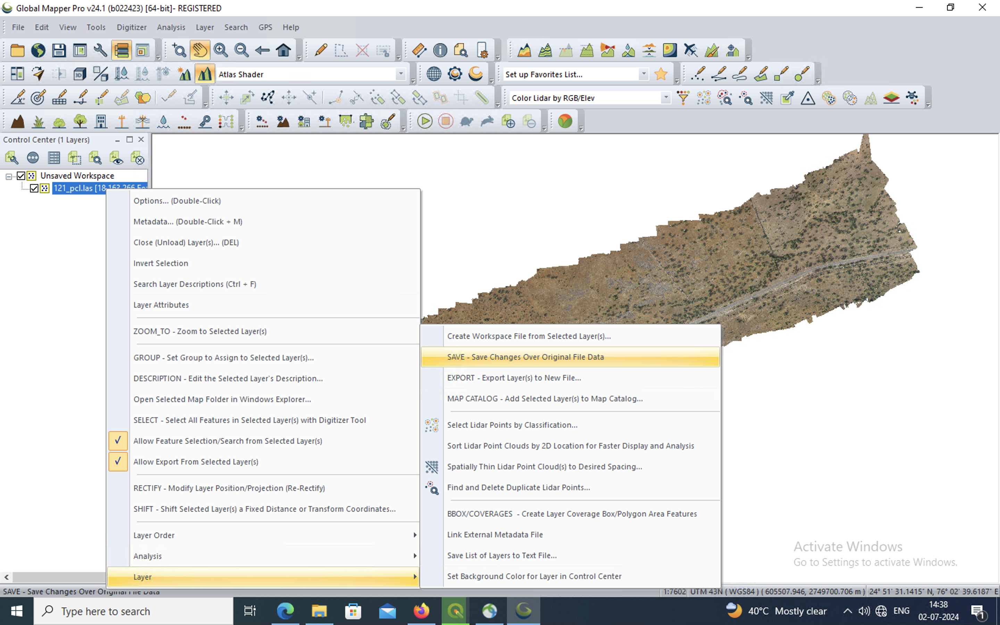

# Tree Detection in 3d las files

This repository contains scripts and tools for processing LiDAR data to generate tree maps and perform further analysis. The pipeline consists of multiple steps that involve preprocessing, tree detection, and combine results. The steps are executed using Python and R scripts. A Dockerfile is provided to ensure the pipeline can run on any computer with Docker installed.

#### Step to run this code:
- Add two folders "test_data" and "test_results" in the root folder.
- Inside the "test_data" folder, add subfolders that contain the LAS files.
 
The folder structure is below:
```bash
tree detection 3d
│
├── test_data
│   ├─── folder 1
│   │       ├─── file1.las
│   │       └─── file2.las
│   └─── folder 2
│           ├─── file1.las
│           └─── file2.las
├── test_results
│   ├─── folder 1
│   │       ├─── file1
│   │               ├─── py_result (stores the results from generate_tree.py)
│   │               ├─── r_result (stores the results form watershed.R)
│   │               └─── combine_results (stores the results from combine_result.py)
│   └── ... (test result files)
├── preprocess.py
├── generate_tree.py
├── watershed.R
├── combine_results.py
├── utils.py
├── Dockerfile
├── README.md
└── requirements.txt
```
### Setting Up and Running the Project
1. Create Necessary Folders:
    - Open the Command Prompt (CMD).
    - Run this command to create two folders named "test_data" and "test_results". If the folders already exist, you can ignore any errors:
```cmd
mkdir test_data test_results
```

2. Install Docker and then Build the Image using the command below:
```cmd
docker build -t treedetection3d:1 .
```
3. Add the folder containing the las files in the test_data folder.
4. Now run the "preprocess.py" and then the "generate_tree.py" to get the tree shapefiles. These scripts will process the LiDAR data and save the detected tree data in a folder named "py_results". Check the results.
```cmd
docker run -it --rm -v "%cd%/:/myapp/" treedetection3d:1 python3 preprocess.py
docker run -it --rm -v "%cd%/:/myapp/" treedetection3d:1 python3 generate_tree.py
```
5. If the results from the previous step are not good enough, then follow the steps below.
#### Step for post processing
1. You need to manually classify the LiDAR points into ground and non-ground points using a software called Global Mapper Pro:
    - Open the LiDAR file in Global Mapper Pro.
    - Click on the button to classify ground and non-ground points, use the default settings, and click OK.
    - Save the changes to the same file.








4. Now run the watershed_tree.R file. This will generate trees boundary using watershed algorithm. The results are stored in r_results folder.
```bash
docker run -it --rm -v "%cd%/:/myapp/" treedetection3d:1 Rscript watershed.R
```
5. Now run the postprocessing.py file to get the overlapping results. The results are stored in combined_results folder.
```bash
docker run -it --rm -v "%cd%/:/myapp/" treedetection3d:1 python3 combine_results.py
```
### Prerequisites
- Docker installed on your computer.
- Global Mapper Pro for manual classification of points.

### My system info:
```
Memory (RAM): Total RAM: 64 GB
CPU (Processor): AMD Ryzen 5 5600G
Cores and Threads: 6 cores, 12 threads
GPU (Graphics Card): NVIDIA GeForce RTX 3060
Dedicated GPU Memory: 12 GB
OS: Windows 11 pro
```